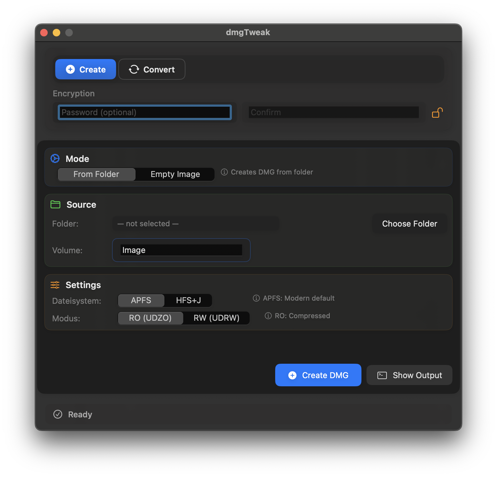
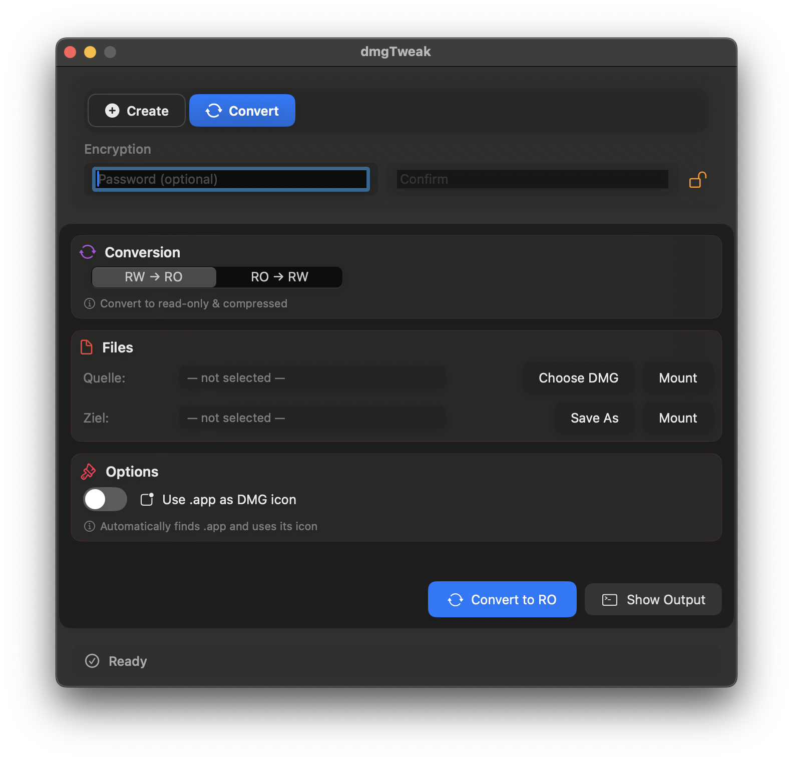
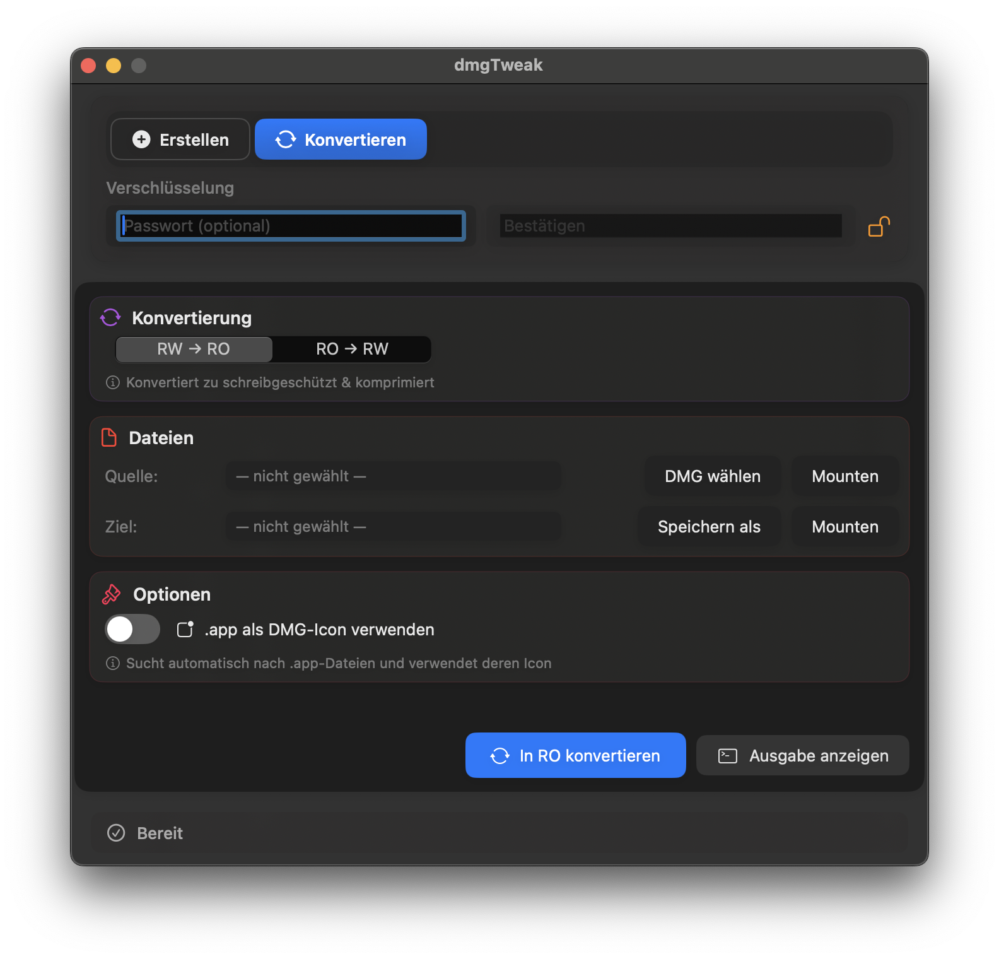

## Sprache

Diese Datei ist die deutsche Anleitung. Die Standard‑README ist auf Englisch.

# dmgTweak

Modernes macOS‑Tool zum Erstellen und Konvertieren von DMGs mit erweitertem Icon‑Support.

## Funktionen

- DMG erstellen: Aus Ordnern oder als leeres Image
- DMG konvertieren: Zwischen Read‑Only (UDZO) und Read‑Write (UDRW)
- Icon‑Support: App‑Icon automatisch extrahieren und auf DMGs anwenden
- Verschlüsselung: Passwortschutz/AES‑256 via hdiutil
- Moderne UI: SwiftUI mit Dark Mode
- Dateisysteme: APFS und HFS+J

## Anforderungen

- macOS 13.0 oder neuer
- Swift 5.9 oder neuer

## Kompilieren & Erstellen

### Entwicklungs‑Build (empfohlen)

```bash
./dev-build.sh
```
Aktualisiert `dist/dmgTweak.app`. Der Zeitstempel des Bundles wird aktualisiert.

### Build‑Skript

```bash
./build.sh
# Schnell‑Build ohne Abhängigkeiten
./build.sh --no-deps --no-lint
```
Das Build‑Skript erledigt:
1. SwiftFormat/SwiftLint installieren/prüfen
2. Formatieren & Linten
3. SwiftPM‑Build
4. dist‑Bundle aktualisieren (Binary: `Contents/MacOS/dmgTweak`)
5. Artefakte nur unter `dist/`

Lokal starten:
```bash
open dist/dmgTweak.app
```

## Lizenz

Apache License 2.0. Siehe `LICENSE`.

## Changelog

### v1.0.0
- Erste öffentliche Version (Apache‑2.0)
- SavePanel: Standard `~/Downloads`, schlägt den aktuellen Volume‑Namen vor
- Erstellen: Speichern‑Dialog beim Klick; Überschreiben nach Bestätigung
- Resets: Pfade/Volume („Image“) nach Erfolg, Inputs beim Moduswechsel
- Lokalisierung: DE/EN aktiv
- Bundle: einheitlicher Binary‑Name `Contents/MacOS/dmgTweak`
- Tooling: SwiftLint/SwiftFormat, Backup vom Lint ausgenommen

## Ausführen (aus dem Source bauen)
1) Repository klonen: `git clone https://github.com/henosch/dmgTweakApp.git && cd dmgTweakApp`
2) Kompilieren: `./dev-build.sh` (empfohlen) oder `swift build`
3) Starten: `open dist/dmgTweak.app`

Sprache
- UI folgt der System‑Sprache (DE/EN).
- Override per Terminal:
  - Englisch: `defaults write de.free.dmgTweak AppleLanguages -array en`
  - Deutsch:  `defaults write de.free.dmgTweak AppleLanguages -array de`
  - Reset:    `defaults delete de.free.dmgTweak AppleLanguages`

## Screenshots

Englische UI

<a href="docs/screenshots/create.png"></a>
<a href="docs/screenshots/convert.png"></a>

Deutsche UI

<a href="docs/screenshots/erstellen.png"></a>
<a href="docs/screenshots/konvertieren.png"></a>
