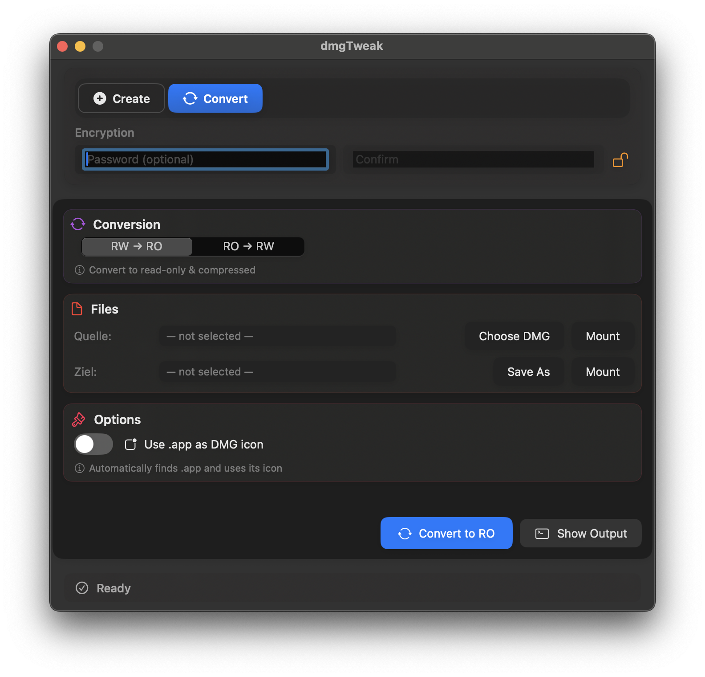
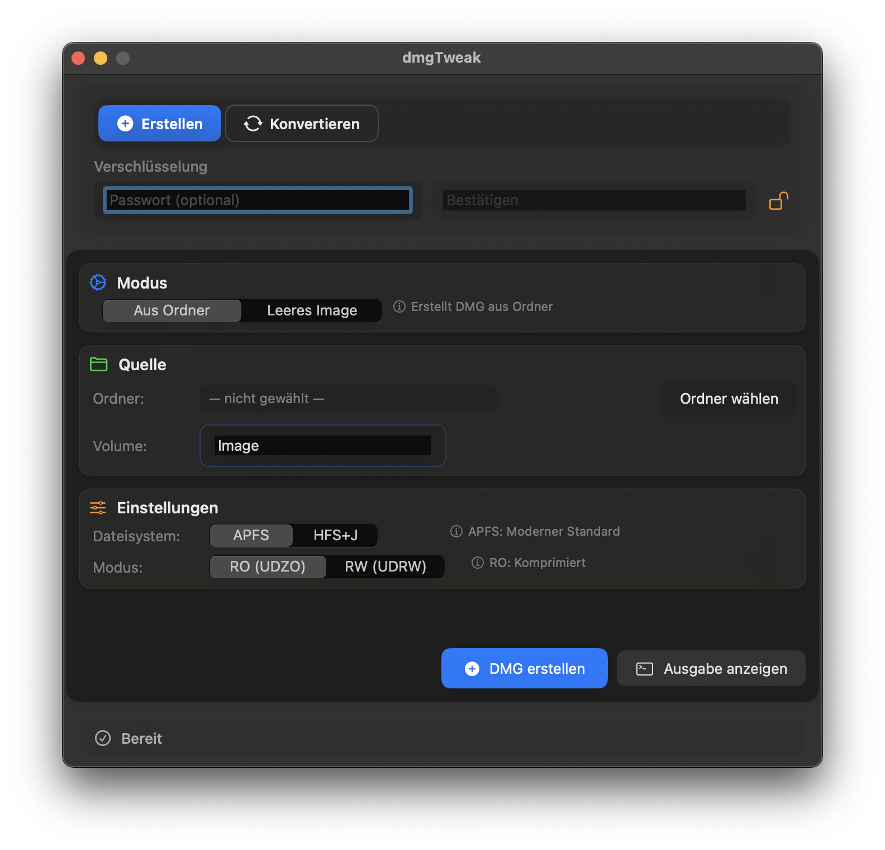
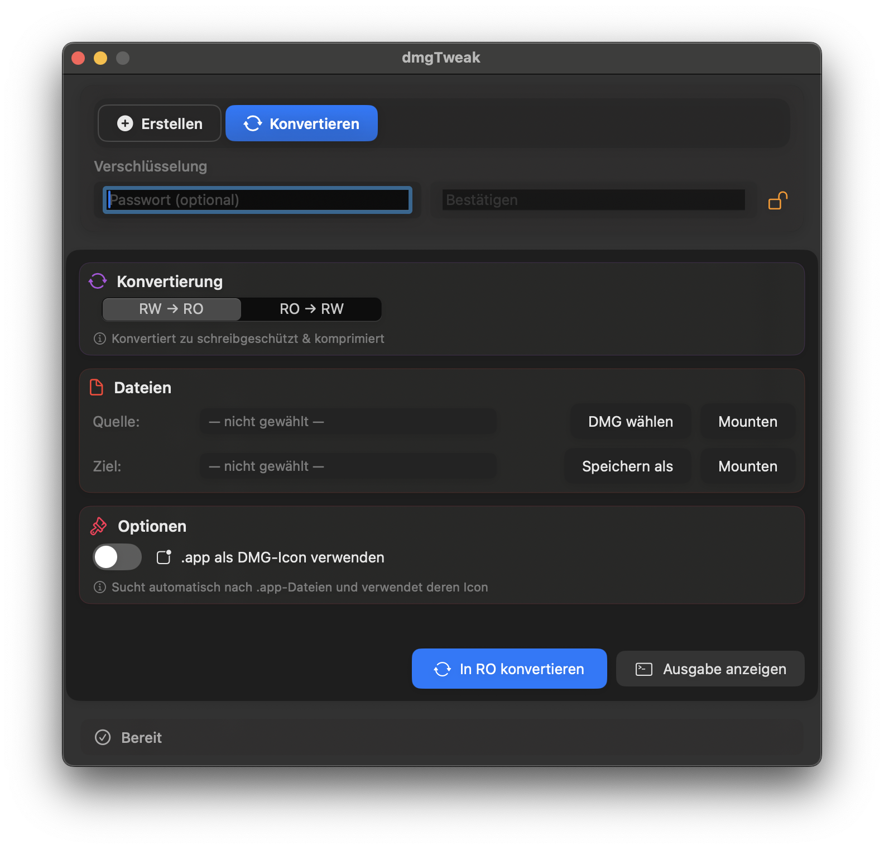

<!-- Language: EN | DE -->
English | [Deutsch](README.de.md)

# dmgTweak

Modern DMG creation and conversion tool for macOS with advanced icon support.

## Features

- **DMG Creation**: Create DMGs from folders or empty images
- **DMG Conversion**: Convert between read-only (UDZO) and read-write (UDRW) formats
- **Icon Support**: Automatically extract and apply app icons to DMGs
- **Password Protection**: Full encryption support for secure DMGs
- **Modern UI**: Native SwiftUI interface with dark mode support
- **File System Options**: Support for APFS and HFS+J formats

## Requirements

- macOS 13.0 or later
- Swift 5.9 or later

## Building

### Using Swift Package Manager

```bash
# Build for debug
swift build

# Build for release
swift build -c release
```

### Development Build (Recommended)

```bash
# Build with automatic .app timestamp update for development
./dev-build.sh

# Also works with swift build arguments
./dev-build.sh -c release
```
This updates `dist/dmgTweak.app`. The bundle timestamp is touched so you can see at a glance if it's the current build.

### Using the Build Script

```bash
# Full build with linting and formatting
./build.sh

# Quick build without dependencies
./build.sh --no-deps --no-lint
```

The build script will:
1. Install/check dependencies (SwiftFormat, SwiftLint)
2. Format and lint the code
3. Compile with Swift Package Manager
4. Update the dist app bundle (binary name inside bundle: `Contents/MacOS/dmgTweak`)
5. Keep outputs only in `dist/`

Run locally:

```bash
open dist/dmgTweak.app
```

## Architecture

The app is built with a clean, modular architecture:

- **dmgTweakApp.swift** - Main SwiftUI app and UI
- **DMGOperations.swift** - Core DMG creation and conversion
- **DMGIconOperations.swift** - Icon-specific operations
- **IconHandler.swift** - Icon extraction and application
- **MountManager.swift** - DMG mounting/unmounting
- **UIComponents.swift** - Reusable UI components
- **FilePickerManager.swift** - File selection utilities

## Code Quality

- ✅ Modular architecture with 13 focused modules
- ✅ Swift Actors for safe concurrency
- ✅ Comprehensive error handling
- ✅ Memory management with automatic cleanup
- ✅ SwiftLint compliant (95%+ violations resolved)

## License

Apache License 2.0. See `LICENSE`.

## Changelog

### v1.0.0
- Initial public release under Apache-2.0
- SavePanel: defaults to `~/Downloads`, suggests current Volume name
- Create flow: shows SavePanel on click; replaces existing file after confirmation
- Resets: clears selected paths and resets Volume ("Image") after creation; clears inputs on mode switch
- Locale: Info.plist set to German (dialogs in Deutsch)
- Bundle: unified binary name `Contents/MacOS/dmgTweak`
- Tooling: SwiftLint/SwiftFormat configured; backup file excluded from lint

## Build From Source (macOS)
1) Clone the repo: `git clone https://github.com/henosch/dmgTweakApp.git && cd dmgTweakApp`
2) Build: `./dev-build.sh` (recommended) or `swift build`
3) Run: `open dist/dmgTweak.app`

Language
- UI follows system language (Deutsch/English).
- Override via Terminal:
  - English: `defaults write de.free.dmgTweak AppleLanguages -array en`
  - German:  `defaults write de.free.dmgTweak AppleLanguages -array de`
  - Reset:   `defaults delete de.free.dmgTweak AppleLanguages`

## Screenshots

English UI

<a href="docs/screenshots/create.png"></a>
<a href="docs/screenshots/convert.png"></a>

German UI

<a href="docs/screenshots/erstellen.png"></a>
<a href="docs/screenshots/konvertieren.png"></a>
